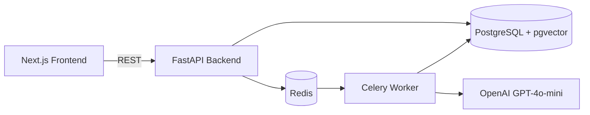

# Triax

**AI-powered fintech support ticket triage system**

[](https://github.com/adewale-codes/triax/actions/workflows/ci.yml)


---

## Overview

Fintech support queues are high-stakes. A fraud dispute left unattended for an hour is categorically different from a general KYC question, but without triage both land in the same inbox and get worked in submission order. Triax fixes that.

When a ticket is submitted, a Celery worker picks it up asynchronously and runs it through a multi-step AI pipeline: the ticket is embedded and compared against a vector store of internal policy documents, classified into one of six issue categories, scored for urgency on a 1–5 scale, and a draft reply is generated — all before a support agent opens the ticket. The agent sees a pre-triaged queue ordered by urgency, with the AI's reasoning surfaced inline so they can validate or override it in seconds.

The system is built as a production-style monorepo: FastAPI backend with async SQLAlchemy and Alembic migrations, a Next.js 14 App Router frontend, PostgreSQL with pgvector for semantic search, and Redis + Celery for background processing. Everything runs in Docker Compose and ships with a CI pipeline and a Makefile for common operations.

---

## Architecture



---

## Tech Stack

| Layer | Technology | Purpose |
|---|---|---|
| Frontend | Next.js 14 + TypeScript + Tailwind | Agent queue, ticket detail, analytics dashboard |
| Backend | FastAPI + Python 3.12 | REST API, dependency injection, async task dispatch |
| Database | PostgreSQL 16 | Persistent storage for tickets and policy documents |
| Vector Store | pgvector | Cosine similarity search over policy document embeddings |
| Task Queue | Celery | Async AI pipeline — runs after ticket creation |
| Message Broker | Redis 7 | Celery broker and result backend |
| AI / LLM | OpenAI GPT-4o-mini + text-embedding-ada-002 | Classification, urgency scoring, reply generation |
| Containerisation | Docker + Docker Compose | Local dev and deployment |

---

## Quick Start

```bash
git clone https://github.com/adewale-codes/triax
cd triax
cp .env.example .env
# Add your OPENAI_API_KEY to .env
make up
make migrate
# Open http://localhost:3000
```

The API is available at `http://localhost:8000`. The frontend at `http://localhost:3000`.

On first startup the API seeds the vector store with policy documents (requires a valid `OPENAI_API_KEY`). If the key is missing the app still starts — seeding is logged as a warning and skipped.

---

## Features

- **Ticket ingestion** — REST API endpoint with Pydantic validation
- **AI issue classification** — six categories: `payment_failure`, `p2p_dispute`, `kyc_query`, `fraud_flag`, `withdrawal_issue`, `general_enquiry`
- **Urgency scoring** — 1–5 scale with financial loss, fraud keywords, and account access weighted higher
- **Suggested reply generation** — professional first-response draft, referencing relevant policy
- **AI reasoning panel** — plain-English explanation of classification and urgency decision
- **Semantic policy search** — pgvector cosine similarity against 10 seeded policy documents
- **Async pipeline** — Celery worker processes tickets in the background; UI polls until complete
- **Agent queue** — dark, dense table view with urgency indicators, issue tags, and auto-refresh every 10 s
- **Ticket detail** — shimmer loading states while AI processes, copyable suggested reply, expandable policy doc cards
- **Analytics dashboard** — 4 summary cards, 5 recharts charts (bar, pie, line), 30-second auto-refresh

---

## API Reference

| Method | Path | Description |
|---|---|---|
| `GET` | `/health` | Service health check |
| `POST` | `/api/v1/tickets` | Create a ticket and trigger AI pipeline |
| `GET` | `/api/v1/tickets` | List all tickets, ordered by `created_at` desc |
| `GET` | `/api/v1/tickets/{id}` | Get a single ticket by UUID |
| `GET` | `/api/v1/analytics` | Aggregated metrics over all ticket data |

---

## Project Structure

```
triax/
├── .github/
│   └── workflows/
│       └── ci.yml
├── backend/
│   ├── alembic/
│   │   └── versions/
│   │       ├── 001_create_tickets_table.py
│   │       └── 002_add_ai_fields.py
│   ├── models/
│   │   ├── policy_document.py
│   │   └── ticket.py
│   ├── routers/
│   │   ├── analytics.py
│   │   └── tickets.py
│   ├── services/
│   │   ├── ai_pipeline.py
│   │   └── seed.py
│   ├── tests/
│   │   ├── conftest.py
│   │   ├── test_analytics.py
│   │   ├── test_health.py
│   │   └── test_tickets.py
│   ├── database.py
│   ├── main.py
│   ├── worker.py
│   ├── Dockerfile
│   └── requirements.txt
├── frontend/
│   ├── app/
│   │   ├── analytics/page.tsx
│   │   ├── tickets/
│   │   │   ├── [id]/page.tsx
│   │   │   └── new/page.tsx
│   │   ├── globals.css
│   │   ├── layout.tsx
│   │   └── page.tsx
│   ├── components/
│   │   ├── ExplanationPanel.tsx
│   │   ├── IssueTypeTag.tsx
│   │   ├── Navbar.tsx
│   │   ├── ProcessingStatus.tsx
│   │   ├── StatusBadge.tsx
│   │   └── UrgencyIndicator.tsx
│   ├── lib/
│   │   ├── api.ts
│   │   └── utils.ts
│   ├── Dockerfile
│   ├── next.config.js
│   └── package.json
├── .env.example
├── .gitignore
├── docker-compose.yml
├── Makefile
└── README.md
```

---

## Environment Variables

| Variable | Description | Example |
|---|---|---|
| `DATABASE_URL` | PostgreSQL connection string | `postgresql://triax:triax@db:5432/triax` |
| `POSTGRES_DB` | Database name | `triax` |
| `POSTGRES_USER` | Database user | `triax` |
| `POSTGRES_PASSWORD` | Database password | `triax` |
| `ENVIRONMENT` | Deployment environment | `development` |
| `REDIS_URL` | Redis connection string | `redis://redis:6379/0` |
| `OPENAI_API_KEY` | OpenAI API key (required for AI pipeline) | `sk-...` |

---

## Architecture Decisions

**LLM provider:** The pipeline was designed to be model-agnostic. During development, local inference was tested with Ollama and Llama 3.2 3B. OpenAI GPT-4o-mini was chosen for the demo because latency matters for the support agent experience — local CPU inference averaged 8-10 minutes per ticket versus 2-3 seconds with the API. In a production deployment with GPU infrastructure, swapping back to a local model requires only changing the `ai_pipeline.py` service layer. The Ollama services are kept commented out in `docker-compose.yml` for reference.

---

## Development

Run tests (requires the stack to be up):

```bash
make test
```

Run tests locally without Docker:

```bash
cd backend
pip install -r requirements.txt
pytest tests/ -v
```

View logs:

```bash
make logs          # all services
make logs-worker   # Celery worker only
```

Tear down (keep data):

```bash
make down
```

Tear down and wipe volumes:

```bash
make down-v
```
